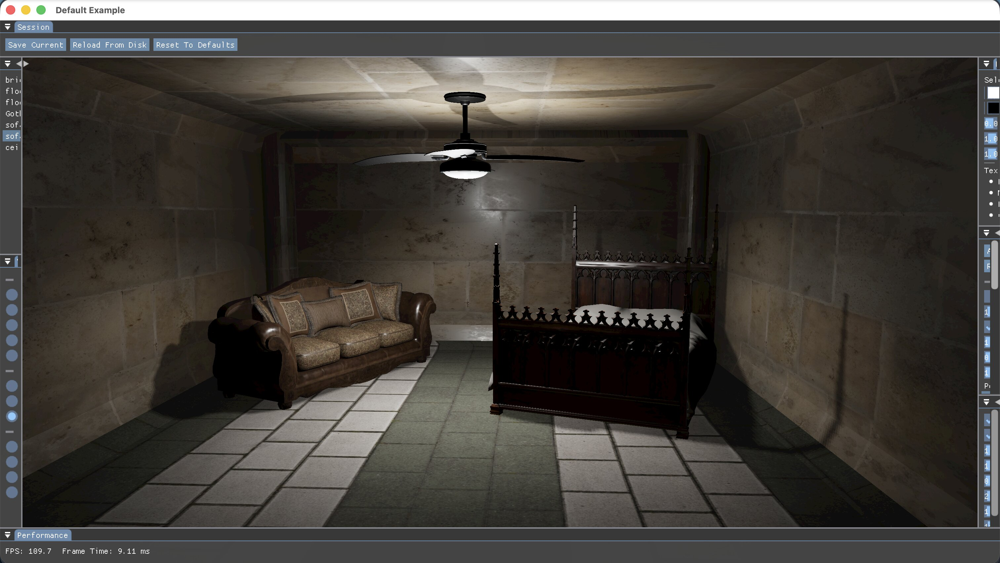
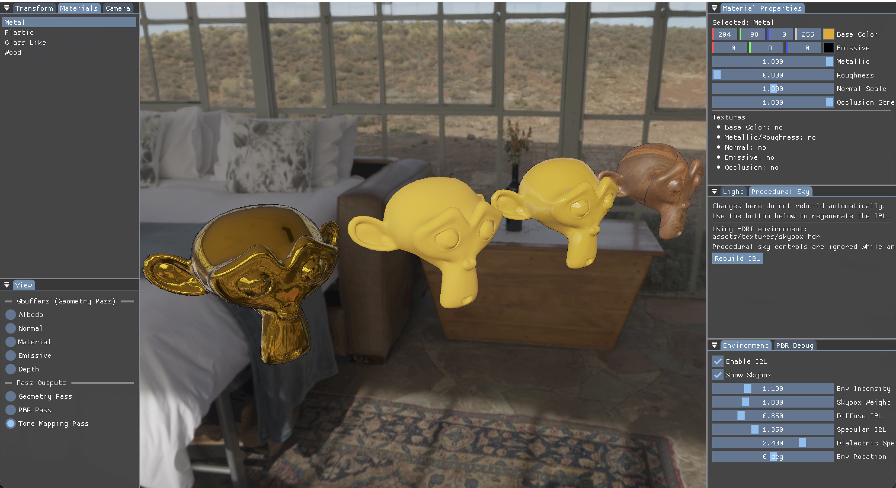

<div align="center" style="margin-bottom:10px">
    
</div>

<p align="center">
  <a href="https://github.com/MerliMejia/Abstracto/wiki"></a>
  
  
  
  
  
</p>

<p align="center">
  
  
</p>

Abstracto is a Vulkan renderer that turns the API's moving parts into named, reusable layers. It is built as a collection of abstractions, not a rigid framework: you can stay close to the metal with the backend contexts, or move upward into a pass-oriented renderer with scene passes, pass-owned uniforms, fullscreen post-process passes, model loading, scene lighting, shadow mapping, PBR, tonemapping, debug presentation, overlay tools, and an ImGui control layer.

The name comes from the Spanish word for "abstract." That is the point of the project: learn Vulkan by breaking it into smaller systems that are easier to understand, reuse, and compose.




## Why Abstracto?

- Thin bootstrap path: get a window, Vulkan device, swapchain, command buffers, and frame sync without committing to a full engine.
- Layered renderer API: move from `VulkanBackend` into `RenderPass`, `PassRenderer`, `SceneRenderPass`, `UniformSceneRenderPass`, and `FullscreenRenderPass`.
- Real sample app in `src/main.cpp`: the current demo loads a night scene, renders one directional shadow map plus three spot shadow maps, then runs `GeometryPass -> PbrPass -> TonemapPass -> DebugPresentPass -> DebugOverlayPass -> ImGuiPass`.
- Asset pipeline included: OBJ and glTF loading, textures, samplers, material bindings, HDR environment maps, procedural-sky IBL baking, and debug-session persistence.
- Built to be studied: the wiki walks from a triangle on the swapchain to pass-owned uniforms and fullscreen source-pass sampling.

### Abstraction ladder

| Layer                   | What it gives you                                                                                           |
| ----------------------- | ----------------------------------------------------------------------------------------------------------- |
| Bootstrap               | `AppWindow`, `BackendConfig`, `VulkanBackend`, `FrameState`                                                 |
| Backend contexts        | `InstanceContext`, `SurfaceContext`, `DeviceContext`, `SwapchainContext`, `CommandContext`, `FrameSync`     |
| Geometry and assets     | `Mesh`, `FullscreenMesh`, `RenderableModel`, `ObjModelAsset`, `GltfModelAsset`                              |
| Materials and resources | `Texture`, `Sampler`, `DescriptorBindings`, `FrameGeometryUniforms`, `ImageBasedLighting`, `SceneLightSet`  |
| Rendering core          | `RenderPass`, `RenderItem`, `PassRenderer`, `PipelineSpec`, `ShaderProgram`                                 |
| High-level pass types   | `SceneRenderPass`, `UniformSceneRenderPass`, `FullscreenRenderPass`                                         |
| Concrete features       | `GeometryPass`, `ShadowPass`, `PbrPass`, `TonemapPass`, `DebugPresentPass`, `DebugOverlayPass`, `ImGuiPass` |

For the full breakdown, see the wiki page: [Current abstractions in the project](https://github.com/MerliMejia/Abstracto/wiki/Current-abstractions-in-the-project).

## What The Current Sample App Shows

- A Vulkan backend with swapchain lifecycle, command submission, and frame synchronization.
- A night-scene demo that loads `assets/models/night.glb` and uses `assets/textures/dikhololo_night_4k.hdr` as the default environment.
- A render setup that draws the scene into the G-buffer, computes fullscreen PBR lighting, tonemaps HDR output, presents selectable debug views, draws light markers, and overlays an ImGui UI.
- Runtime scene lights with directional, point, and spot types, plus shadow casting for one directional light and up to three spot lights.
- Material editing, camera movement, model transforms, tonemap controls, PBR debug views, output switching, performance stats, session save/reload, and IBL controls in the debug UI.
- Slang shaders compiled to SPIR-V, with generated `.spv` files already checked into `assets/shaders`.

## Current Render Graph

The sample app does more than a straight linear pass chain. The scene model is rendered into the geometry pass and also into the enabled shadow passes:

- `ShadowPass` for the primary directional light
- `ShadowPass x3` for spot lights
- `GeometryPass` for albedo, normals, material data, emissive, and depth
- `PbrPass`, which samples the G-buffer, the IBL resources, and the four shadow maps
- `TonemapPass` for HDR to display mapping
- `DebugPresentPass`, which can present G-buffer outputs, lighting outputs, tonemapped output, or any of the shadow maps
- `DebugOverlayPass`, which draws line-based light markers on top of the selected presentation
- `ImGuiPass` for runtime controls

Point-light shadows are not implemented yet, but point lights still contribute to the lighting pass.

## Quick Start

### Requirements

- CMake 3.20+
- A C++20 compiler
- A Vulkan SDK or Vulkan loader/runtime available to CMake
- `slangc` if you want CMake to regenerate SPIR-V from `.slang` files
- Git if you want CMake to auto-fetch missing dependencies

### Build

```bash
cmake -S . -B build -DABSTRACTO_FETCH_DEPS=ON
cmake --build build -j4
./build/Abstracto
```

`ABSTRACTO_FETCH_DEPS` is enabled by default and can fetch these libraries when they are missing:

- GLFW
- GLM
- stb
- tinyobjloader
- tinygltf
- Dear ImGui

If `slangc` is not installed, the current checked-in `.spv` files still let the project build. You only need `slangc` when you add or modify Slang shaders and want CMake to regenerate them automatically.

## Runtime Notes

- Camera: move with `W`, `A`, `S`, `D`, `Q`, `E`; hold right mouse button and drag to look around.
- Debug presentation: inspect G-buffer attachments, the lit PBR output, the tonemapped output, or the directional and spot shadow maps.
- PBR debug modes: isolate final shading, direct lighting, diffuse IBL, specular IBL, ambient total, reflections, or background contribution.
- Light editing: add/remove directional, point, and spot lights; tune color, power, exposure, direction, range, cone angles, marker visibility, and shadow bias settings.
- Session persistence: the UI can save and reload the current debug session through `assets/debug/last_session.json`.
- Environment workflow: the default session uses an HDRI. Procedural sky settings are still available for IBL baking when no HDR path is active.

## Pick Your Level

- Want only a clean Vulkan bootstrap? Start with `AppWindow`, `BackendConfig`, and `VulkanBackend`.
- Want direct control over the low-level setup? Work from the backend contexts in `src/backend`.
- Want to route meshes through reusable render stages? Build on `RenderPass`, `RenderItem`, and `PassRenderer`.
- Want pass-owned uniform buffers and optional push constants? Extend `UniformSceneRenderPass<TUniform, TPush>`.
- Want a post-process that samples another pass? Extend `FullscreenRenderPass`.
- Want the most complete reference in this repo? Read `src/main.cpp` and follow the passes downward.

## Learning Path

The wiki is one of the best parts of this repo. It does not just explain what classes exist; it shows how the abstractions are meant to be used.

| Step | Focus                                             | Wiki                                                                                                                                                                              | Branch                                    |
| ---- | ------------------------------------------------- | --------------------------------------------------------------------------------------------------------------------------------------------------------------------------------- | ----------------------------------------- |
| 0    | Bootstrap the smallest window + backend setup     | [How To](<https://github.com/MerliMejia/Abstracto/wiki/How-To-(Work-In-Progress)>)                                                                                                | `example-minimal-code`                    |
| 1    | Learn the abstraction map                         | [Current abstractions in the project](https://github.com/MerliMejia/Abstracto/wiki/Current-abstractions-in-the-project)                                                           | `main`                                    |
| 2    | Render a triangle straight to the swapchain       | [Triangle to the Swapchain Tutorial](https://github.com/MerliMejia/Abstracto/wiki/Triangle-to-the-Swapchain-Tutorial)                                                             | `tutorial-triangle-to-swapchain`          |
| 3    | Add a pass-owned uniform buffer and push constant | [Animated Triangle with a Pass-Owned Uniform or Push Constant](https://github.com/MerliMejia/Abstracto/wiki/Animated-Triangle-with-a-Pass%E2%80%90Owned-Uniform-or-Push-Constant) | `tutorial-animated-triangle-to-swapchain` |
| 4    | Feed one pass into a fullscreen post-process      | [Fullscreen Post-Process over a Source Pass](https://github.com/MerliMejia/Abstracto/wiki/Fullscreen-Post%E2%80%90Process-over-a-Source-Pass)                                     | `tutorial-fullscreen-post-process`        |

Wiki home: [Abstracto Wiki](https://github.com/MerliMejia/Abstracto/wiki)

From there, the current sample app extends the same abstractions into scene-light management, shadow mapping, debug presentation, and runtime tooling.

## Cool things about this project

- It treats "abstraction" as something you can inspect instead of something hidden behind a giant engine wall.
- It keeps the low-level Vulkan pieces visible enough to learn from, while still giving you higher-level rendering building blocks.
- It uses the same pass model for simple tutorial triangles and for the more complete night-scene, shadow-mapped PBR pipeline in the current sample app.

If you want a renderer that is small enough to read, but structured enough to grow, this is a repo to study.
