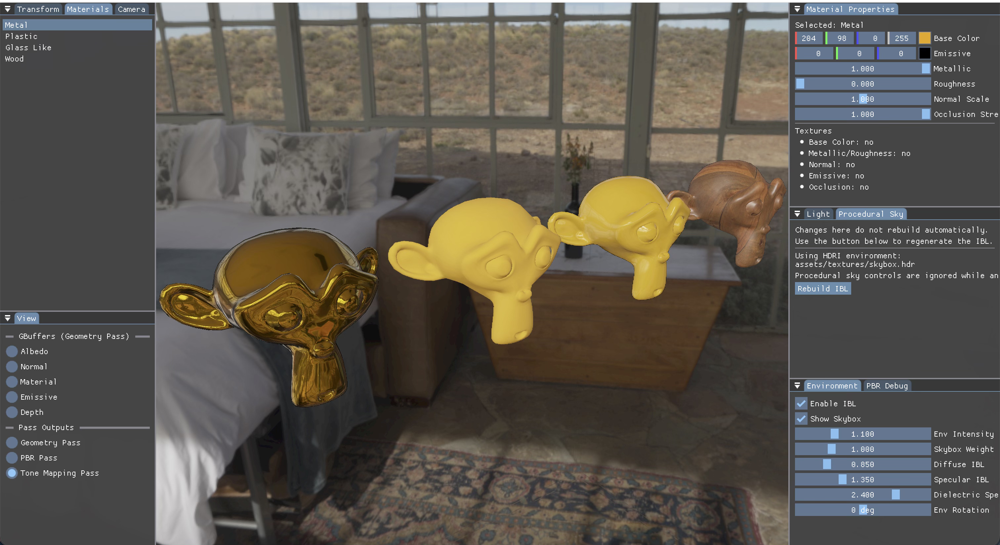
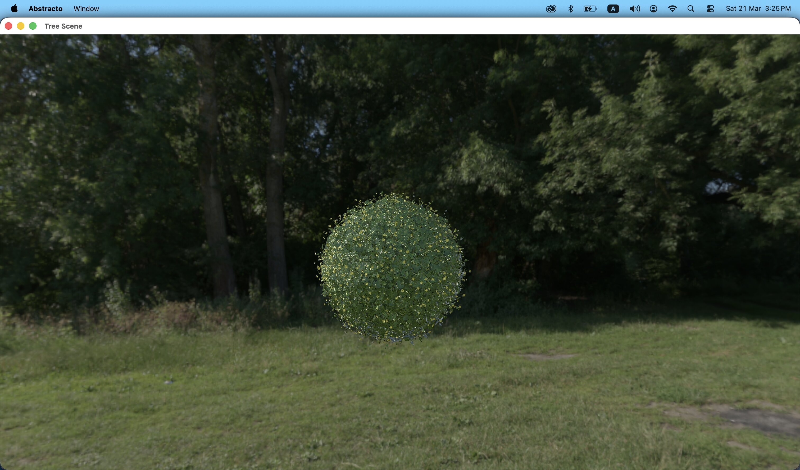
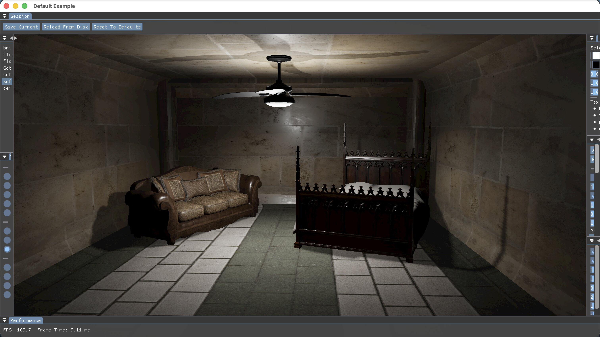

<div align="center" style="margin-bottom:10px">
  
</div>

<p align="center">
  <a href="https://github.com/MerliMejia/Abstracto/wiki"></a>
  
  
  
  
  
</p>

<p align="center">
  
  
</p>

<p align="center">
  <strong>Abstracto is a Vulkan renderer meant to be studied.</strong><br />
  It turns Vulkan into a sequence of named abstractions you can follow from a working renderer down to backend contexts and finally to Vulkan-Hpp itself.
</p>

<p align="center">
  
  
  
</p>

## What Abstracto Is

Abstracto is not trying to hide Vulkan behind a black box engine.

It is trying to make Vulkan readable.

The project started as part of a Vulkan learning process, and the core idea is
still the same: give each useful chunk of the renderer a name, keep the layers
small enough to inspect, and let readers walk downward from "something renders"
to "this is the Vulkan object or call doing the work."

That is why the renderer is organized as a stack of reusable abstractions
instead of one giant framework.

## What You Can Study Here

- Vulkan bootstrap without committing to a full engine architecture
- backend ownership split into instance, surface, device, swapchain, commands,
  and synchronization
- reusable pass-oriented renderer infrastructure
- pass-owned uniforms, sampled outputs, and fullscreen pass chaining
- concrete renderer features such as geometry, shadows, PBR, tonemapping,
  debug presentation, overlays, and ImGui
- how renderer-facing meshes, textures, descriptors, and materials connect to
  actual GPU resources

## The Abstraction Descent

The useful way to read `Abstracto` is from the highest working surface downward.

### Pass path

This is the path most readers should follow first:

`GeometryPass` / `ShadowPass` / `PbrPass` / `TonemapPass`
-> `SceneRenderPass` / `FullscreenRenderPass` / `UniformSceneRenderPass`
-> `RasterRenderPass`
-> `RenderPass`
-> `vk::raii::CommandBuffer`, `vk::RenderingInfo`, pipelines, descriptor sets,
and other Vulkan-Hpp types

### Backend path

This is the frame-lifecycle descent:

`VulkanBackend`
-> `InstanceContext`, `SurfaceContext`, `DeviceContext`, `SwapchainContext`,
`CommandContext`, `FrameSync`
-> `vk::raii::Instance`, `vk::raii::Device`, `vk::raii::Queue`,
`vk::raii::SwapchainKHR`, `vk::SubmitInfo`, `vk::PresentInfoKHR`,
`vk::InstanceCreateInfo`

### Resource path

This is the resource-management descent:

`Mesh` / `Texture` / `DescriptorBindings` / `ModelMaterialSet`
-> `RenderUtils`, `FrameGeometryUniforms`, `SkinPaletteBindings`
-> `vk::raii::Buffer`, `vk::raii::Image`, `vk::raii::DeviceMemory`,
barriers, copies, and layout transitions

The important point is that the "nice" API surface is not the bottom.
`Abstracto` keeps going until the abstractions map very closely to Vulkan.

## Current Layer Map

These are the main renderer-facing layers in the repo today:

| Layer | Main types |
| --- | --- |
| Bootstrap and frame lifecycle | `AppWindow`, `BackendConfig`, `FrameState`, `VulkanBackend` |
| Backend contexts | `InstanceContext`, `SurfaceContext`, `DeviceContext`, `SwapchainContext`, `CommandContext`, `FrameSync` |
| Geometry and draw resources | `Mesh`, `TypedMesh<T>`, `VertexMesh`, `ImportedGeometryMesh`, `FullscreenMesh` |
| Material, texture, and descriptor resources | `Texture`, `Sampler`, `DescriptorBindings`, `FrameGeometryUniforms`, `SkinPaletteBindings`, `ModelMaterialSet`, `RenderUtils` |
| Image-based lighting | `ImageBasedLighting`, `ImageBasedLightingBaker` |
| Rendering core | `RenderItem`, `RenderPass`, `PassRenderer`, `PipelineSpec`, `ShaderProgram`, `PassUniformSet<T>`, `PassImageSet`, `RasterRenderPass` |
| High-level pass types | `SceneRenderPass`, `UniformSceneRenderPass<TUniform, TPush>`, `FullscreenRenderPass`, `MeshRenderPass`, `UniformMeshRenderPass<TUniform, TPush>` |
| Concrete passes | `GeometryPass`, `ShadowPass`, `LightPass`, `PbrPass`, `TonemapPass`, `DebugPresentPass`, `DebugOverlayPass`, `ImGuiPass` |

If you want the fuller breakdown with supporting types and a suggested reading
order, see the wiki page for [Current abstractions in the project](https://github.com/MerliMejia/Abstracto/wiki/Current-abstractions-in-the-project).

## How [`abstracto-engine`](https://github.com/MerliMejia/abstracto-engine) Uses Abstracto

`Abstracto` is the renderer repo, not the whole engine.

In the larger workspace,
[`abstracto-engine`](https://github.com/MerliMejia/abstracto-engine) treats
this repo as the rendering substrate and composes scene, animation, assets,
editor tooling, and runtime behavior around it.

The current engine-side usage looks like this:

1. `DefaultEngineApp` boots `VulkanBackend`, creates renderer-owned meshes,
   initializes image-based lighting, and initializes the pass chain.
2. `AppRendererSetup` registers the pass stack in order:
   `ShadowPass`, `GeometryPass`, `PbrPass`, `TonemapPass`,
   `DebugPresentPass`, `DebugOverlayPass`, and `ImGuiPass`.
3. `RenderableModel` turns loaded model assets into renderer-facing
   `RenderItem`s with material bindings, optional skin palette bindings, and
   per-submesh routing.
4. `SceneRenderItemBuilder` rebuilds the frame's `RenderItem` list, routes
   visible scene assets into geometry and shadow passes, and appends fullscreen
   items for `PbrPass`, `TonemapPass`, and `DebugPresentPass`.
5. `PassRenderer` records the pass chain into the current command buffer.
6. `VulkanBackend` submits the finished work and presents the swapchain image.

That makes `Abstracto` the layer that owns rendering concepts and Vulkan-facing
resources, while
[`abstracto-engine`](https://github.com/MerliMejia/abstracto-engine) stays
focused on composition, tools, scene state, and runtime orchestration.

## Learn The Repo In Order

If your goal is to understand the renderer instead of only building it, this is
the best learning path:

1. Start on the [Wiki Home](https://github.com/MerliMejia/Abstracto/wiki) for the project motivation and learning direction.
2. Read [How To (Work In Progress)](https://github.com/MerliMejia/Abstracto/wiki/How-To-(Work-In-Progress)) for the minimal bootstrap and the overview of how the layers are meant to be used.
3. Read [Current abstractions in the project](https://github.com/MerliMejia/Abstracto/wiki/Current-abstractions-in-the-project) for the current layer map and reading order.
4. Read [Triangle First Tutorial](https://github.com/MerliMejia/Abstracto/wiki/Triangle-First-Tutorial) if you want the guided "start high, peel layers away" version of the repo.
5. Read [Triangle to the Swapchain Tutorial](https://github.com/MerliMejia/Abstracto/wiki/Triangle-to-the-Swapchain-Tutorial) for the smallest useful custom pass example.
6. Read [Animated Triangle with a Pass-Owned Uniform or Push Constant](https://github.com/MerliMejia/Abstracto/wiki/Animated-Triangle-with-a-Pass%E2%80%90Owned-Uniform-or-Push-Constant) to see pass-owned GPU data and a higher-level pass helper in action.
7. Read [Fullscreen Post-Process over a Source Pass](https://github.com/MerliMejia/Abstracto/wiki/Fullscreen-Post%E2%80%90Process-over-a-Source-Pass) once you want to study pass-to-pass chaining.

If you only remember one thing, remember this:

`Abstracto` is meant to be read downward.

Start with something that works. Change one layer. Then open the layer below
it. Repeat until the abstraction turns back into Vulkan.

## Repo Layout

- `src/backend`
  Vulkan bootstrap and frame lifecycle contexts
- `src/core`
  renderer contracts, pass composition, and reusable pass infrastructure
- `src/resources`
  meshes, textures, samplers, descriptor-backed resources, and GPU upload
  helpers
- `src/lighting`
  image-based lighting types, bake settings, and runtime resources
- `src/debug`
  renderer-owned debug visualization helpers
- `src/passes`
  concrete renderer features built on the rendering core
- `resources/shaders`
  Slang sources and checked-in SPIR-V outputs
- `apps/module_examples/renderer/main.cpp`
  current renderer example entry point

## Current Feature Set

- Vulkan window, device, swapchain, command-buffer, and frame-sync bootstrap
- reusable pass-oriented renderer core
- offscreen color outputs that later passes can sample
- pass-owned uniform buffers and optional push constants
- geometry, shadow, fullscreen lighting, PBR, tonemapping, and debug passes
- image-based lighting support and baking
- renderer-side debug light markers, skeleton overlays, and skin palette
  bindings
- Slang shader flow with checked-in SPIR-V outputs

## Build

### Requirements

- CMake 3.20+
- a C++20 compiler
- a Vulkan SDK or Vulkan loader/runtime available to CMake
- `slangc` only if you want CMake to regenerate `.spv` files from `.slang`
- Git only if you want CMake to auto-fetch missing dependencies

### Build commands

```bash
cmake -S . -B build -DABSTRACTO_FETCH_DEPS=ON
cmake --build build -j4
./build/Abstracto
```

`ABSTRACTO_FETCH_DEPS` is enabled by default and can fetch these libraries when
they are missing:

- GLFW
- GLM
- stb
- tinyobjloader
- tinygltf
- Dear ImGui

If `slangc` is not installed, the checked-in `.spv` files still allow the
project to build. You only need `slangc` when you add or modify Slang shaders
and want CMake to regenerate them automatically.

## Scope

This repo is the renderer.

Scene management, animation playback, asset import orchestration, editor
tooling, and application composition are intentionally kept outside this repo
and assembled in the wider workspace.

If you want a renderer that stays close enough to Vulkan to study while still
giving you reusable rendering layers, that is what `Abstracto` is for.
